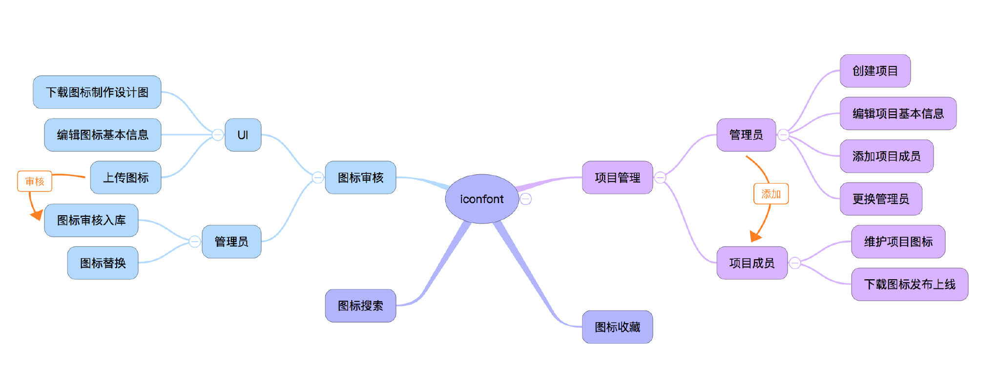
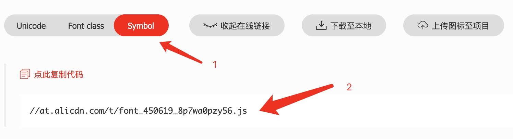

# Icon 图标组件

Icon 图标组件，支持自定义

推荐参考：https://ant.design/components/icon-cn

## 示例

svgr 加载

<code src="./demos/demo1.tsx"></code>

createIcon & createFromIconfont

<code src="./demos/demo2.tsx"></code>

IconSvg

<code src="./demos/demo3.tsx"></code>

IconFont （本地引入 symbol 的方案）

<code src="./demos/demo4.tsx"></code>

antd-mobile-icons 不提供源码，想定制 icon 组件，怎么办？

## 自定义 icon 图标组件库

antd-mobile-icons 不满足业务需求，也没提供源码（[相关 ISSUE 讨论](https://github.com/ant-design/antd-mobile-icons/issues/4)），我们想定制自己的 icon 图标组件库，怎么办？

下面介绍一种方法，能快速实现自定义实现满足业务诉求的 icon 图标组件库

## 关于 ICON 图标

因为图片图标或 font 图标，都存在一些问题

- 图片图标
  - 不支持变色
  - 不是矢量图，易失真

对于 font 图标，svg 图标有以下优势：

- 完全离线化使用，不需要从 CDN 下载字体文件，图标不会因为网络问题呈现方块，也无需字体文件本地部署。
- SVG 是矢量的，在低端设备上 SVG 有更好的清晰度。
- 支持多色图标。
- 对于内建图标的更换可以提供更多 API，而不需要进行样式覆盖。

更多讨论可参考：[#10353](https://github.com/ant-design/ant-design/issues/10353)。

## 关于 iconfont

- https://www.iconfont.cn/

1. 使用 [iconfont.cn](https://www.iconfont.cn/) 平台做 icon 图标的管理，所有 icon 一目了然，方便管理使用
   1. [图标绘制](https://www.iconfont.cn/help/detail)
   2. 存储为 svg 格式（建议使用存储为 svg，不要使用导出为 svg）
2. 如何使用 iconfont.cn 的产物做图标
   1. [代码使用](https://www.iconfont.cn/help/detail?helptype=code)
3. 这里我们推荐使用 svg 图标

### 规范

为了方便管理及使用 svg 图标，做以下规范约定

1. 使用 [iconfont.cn](https://www.iconfont.cn/) 平台做 icon 图标的管理，所有 icon 一目了然
   1. icon 制作要遵守 [图标绘制](https://www.iconfont.cn/help/detail) 规范
   2. 附加约定
      1. 统一 svg 纯色图标（注意边线风格等一致）
      2. 画布统一正方形
      3. 如需单独使用 svg 格式，建议使用存储为 svg（不要使用导出为 svg）
2. iconfont 图标库，统一前缀命名规范(需图标库修改设置)
   1. 设置 `Font Family` 为 `xxfont` 格式，如 `admfont`
   2. 设置 `FontClass/Symbol 前缀` 为 `${Font Family}-` 格式，如 `admfont-`
3. 代码使用，参见以下示例
   1. font-class 方式
   2. symbol 方式（我们使用该模式）

```html
<!-- 拷贝项目下面生成的fontclass代码 -->
<!-- font-class 方式引用 -->
<i class="xxfont xxfont-select"></i>

<!-- symbol 方式引用，可结合 svg-sprite 使用 -->
<svg class="xxfont" aria-hidden="true">
  <use xlink:href="#xxfont-select"></use>
</svg>
```

iconfont 最多支持一次下载 100 个图标，可通过工具对下载的内容 iconfont.svg 进行分割导出独立的 svg 图标。

下面有可用的 cli 工具

### Icon 图标工作流

我们是如下使用的

iconfont 管理平台主要面向设计师 UI 和 前端开发 FE，主要为下面的工作流以及职责：

- 设计师 UI 负责把 icon 上传到平台，通过不同的“大库”区分业务线，形成一个 icon 池；
  - 制作标准 icon，遵守 [图标绘制](https://www.iconfont.cn/help/detail) 规范
  - 管理 icon 资源池（每个业务一个 Icon 素材池或共用一个池子）
- 前端开发 FE 则根据项目需要，从 icon 池中挑选 icon，添加到业务项目，导出外链
  - 规范 icon 命名及使用
  - 管理 icon 项目库（一般分两个）
    - 公共库，跟随基础组件库迭代管理，标准化，更稳定
    - 业务项目库，跟随业务项目迭代管理，更新快，更灵活



> 为避免 iconfont 站点服务异常影响使用，推荐下载引入到本地项目中使用。

### 更新 Icon 流程

使用 cli 脚本更方便，可以将 iconfont 上的 icon 自动转为业务库 svg 的 React组件。

npm 已经有相应的 cli 工具来处理了——[react-iconfont-cli](https://www.npmjs.com/package/react-iconfont-cli)

```bash
pnpm i react-iconfont-cli -D
# 初始化
npx iconfont-init

# 生成配置文件 iconfont.json，示例如下
# 配置配置 symbol_url

# 开始生成React标准组件
npx iconfont-h5
```

`./iconfont.json` 配置示例：

```json
{
    "symbol_url": "//at.alicdn.com/t/c/font_2707658_9cqox8p2rj.js",
    "use_typescript": true,
    "save_dir": "./src/components/iconfont",
    "trim_icon_prefix": "icon",
    "unit": "px",
    "default_icon_size": 16
}
```

注意：`symbol_url` 为 iconfont.cn 上的 js 地址（对应 Symbol 模式），请务必看清 `symbol_url` 配置是.js后缀而不是.css后缀。



每次更新 icon 图标后，重新生成 Symbol 链接，更新 symbol_url 配置后，执行脚本 `npx iconfont-h5` 更新项目的 iconfont 组件即可（每次都是重新生成），无需项目工程配合。

如果是 vue 项目，也有对应的 cli，可自行探索下。

### 使用 icon

iconfont 组件，使用方式如下

```jsx
import IconFont from '@/components/iconfont';

export default () => {
  return (
    <>
      <IconFont name="testfont-packaging" color="red" className="svgicon human" />
    </>
  )
}
```

注意: 这个 `react-iconfont-cli` 工具生成的 React 图标组件有些缺陷，下面有列出问题及解决方案

等有空了，可以提个 PR 优化或 fork 修复。

1. svg 图标不应该使用 `block` 内联样式，使用下面类名 `svgicon` 进行覆盖
2. 扩大点击区域，增加 `human` 类名
3. 关于生成 React 组件，使用 size 属性控制 svg 的宽高
   1. 此处也使用 `svgicon` 类名覆写为 `1em`
   2. 如要控制 icon 图标大小，可使用 style 熟悉设置 `fontSize` 来实现

```css
.svgicon {
  display: inline-block !important;
  width: 1em;
  height: 1em;
  fill: currentColor;
  vertical-align: -0.125em;
  font-size: 16px;
}
/* 优化点击区域 */
.human {
  position: relative;
}
.human:before {
  content: '';
  position: absolute;
  top: -8px;
  right: -8px;
  bottom: -8px;
  left: -8px;
}
```

另一个方案，也比较推荐，但如果项目较老，可能出现构建报错，不如上面的方案独立性好。

## icon 工程化支持

### 关于 icon 自定义

讨论： https://github.com/ant-design/antd-mobile-icons/issues/4

1. 可以用 svgr playground 手动转：https://react-svgr.com/playground/
   1. webpack 配置文档 https://react-svgr.com/docs/webpack/
2. 使用 Umi 内置的 svgr 功能把 svg 文件引入为 React 组件
   1. https://umijs.org/docs/api/config#svgr

```js
// webpack 配置
module.exports = {
  module: {
    rules: [
      // 示例 import Svg from './star.svg'
      {
        test: /\.svg$/i,
        issuer: /\.[jt]sx?$/,
        use: ['@svgr/webpack'],
      },
    ],
  },
}

module.exports = {
  module: {
    rules: [
      // 示例 import svg from './star.svg?url'
      // {
      //   test: /\.svg$/i,
      //   type: 'asset',
      //   resourceQuery: /url/, // *.svg?url
      // },

      // 示例 import Svg from './star.svg'
      // {
      //   test: /\.svg$/i,
      //   issuer: /\.[jt]sx?$/, // 限定 svgr 适用文件类型的范围
      //   resourceQuery: { not: [/url/] }, // exclude react component if *.svg?url
      //   use: ['@svgr/webpack'],
      // },
    ],
  },
}

// 与 url-loader 一起使用
// import starUrl, { ReactComponent as Star } from './star.svg'
module.exports = {
  module: {
    rules: [
      {
        test: /\.svg$/i,
        issuer: /\.[jt]sx?$/,
        use: ['@svgr/webpack', 'url-loader'],
      },
    ],
  },
}
```

svgr 支持如下方式使用 React svg 组件

```jsx
import starUrl, { ReactComponent as Star } from './star.svg'

const App = () => (
  <div>
    
    <Star />
  </div>
)
```

### 命令行

通过命令行自定义 antd-mobile-icons 组件

图标在 iconfont 平台做管理，可以选中需要的图标，批量下载到本地，然后通过工具自动转换为 React 组件

```bash
npm install @svgr/cli --save-dev
./node_modules/.bin/svgr -h
./node_modules/.bin/svgr ./source -d ./dist

svgr ./source -d ./dist
```

```json
{
  "scripts": {
    "svgr": "svgr ./source -d ./dist",
    "start": "webpack serve --config ./webpack.config.js --mode development"
  }
}
```

默认 iconfont 下载的图标，有可能 `fill="currentColor"` 属性不规范，通过 [template](https://react-svgr.com/docs/custom-templates/) 无法批量完成处理，此问题只能制作图标时注意规范。

- 方案详见 https://www.robinwieruch.de/react-svg-icon-components/

以下为命令行批量将 svg 转为 React 组件模板

```js
// my-template.js 示例
// npx @svgr/cli --template my-template.js -- my-icon.svg
const template = (variables, context) => {
  const { imports, interfaces, componentName, props, jsx, exports } = variables
  const { tpl, options } = context

  // console.log(jsx)

  return tpl`
${imports}

${interfaces}

const ${componentName} = (${props}) => {
  props = { ...props, fill: 'currentColor' };
  return ${jsx};
};

export default ${componentName};
`
}

module.exports = template

```

### 使用 webpack

```bash
npm install @svgr/webpack --save-dev
```

webpack 配置

```js
const path = require('path');
const webpack = require('webpack');

module.exports = {
  entry: path.resolve(__dirname, './src/index.js'),
  module: {
    rules: [
      {
        test: /\.(js|jsx)$/,
        exclude: /node_modules/,
        use: ['babel-loader'],
      },
      {
        test: /\.svg$/,
        use: ['@svgr/webpack'],
      },
    ],
  },
  ...
};
```

## 最终设计

可以借助 iconfont 平台辅助管理项目图标，但考虑到容灾，我们将图标保存在项目中，通过脚本将 iconfont 的 symbol 的 js 文件，转为本地图标文件（React 组件或 svgSprite 内容）。

项目中通过 IconSvg 组件配置指定 type 使用对应 Icon。

## 更多参考

- [使用 SVG 交付 Octicon](https://github.com/blog/2112-delivering-octicons-with-svg)
- [内联 SVG 与图标字体](https://css-tricks.com/icon-fonts-vs-svg/)
- [说真的，不要使用图标字体](https://cloudfour.com/thinks/seriously-dont-use-icon-fonts/)
- https://github.com/YMFE/yicon
- https://juejin.cn/post/6979874524934176805
